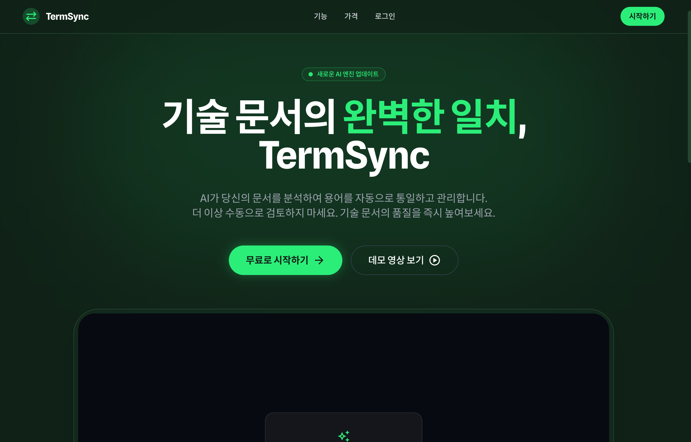
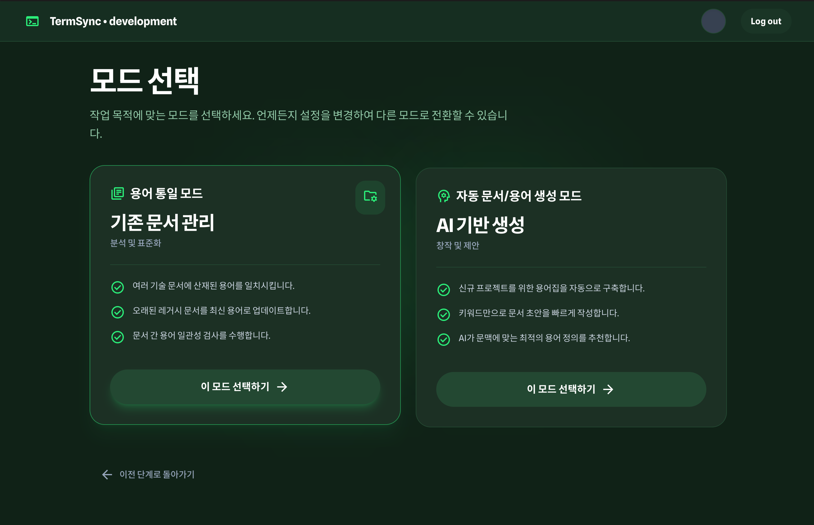
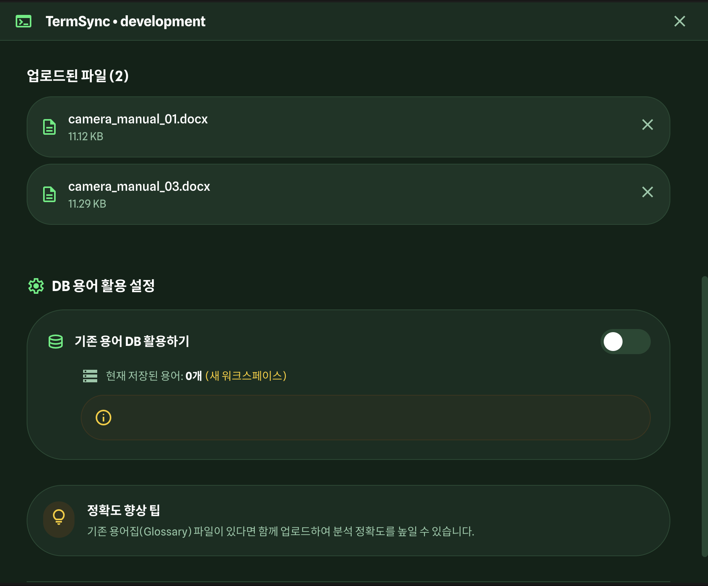
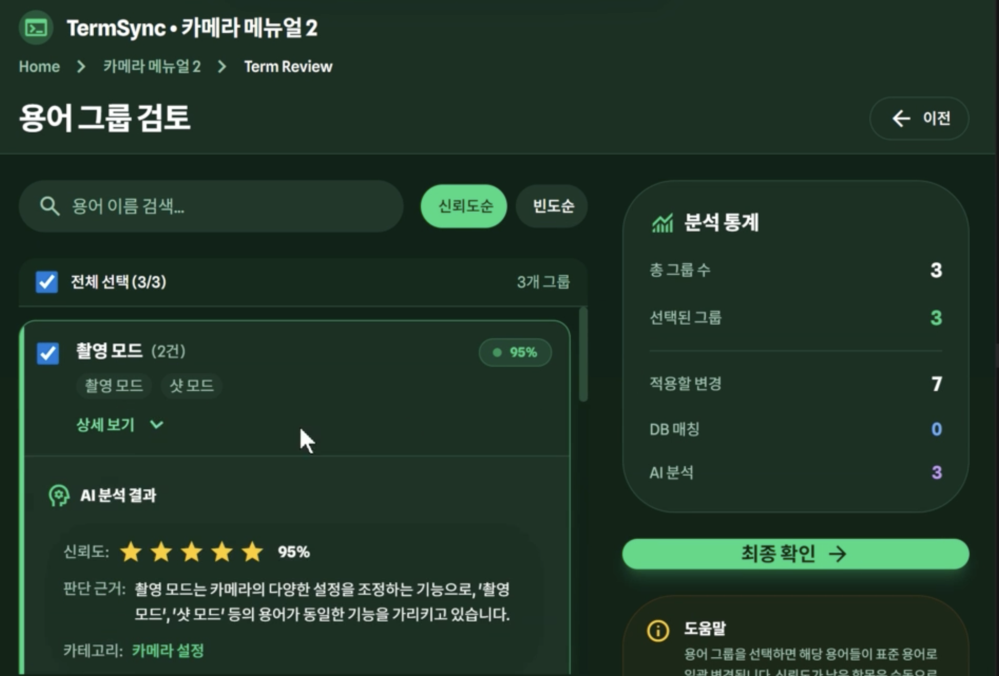
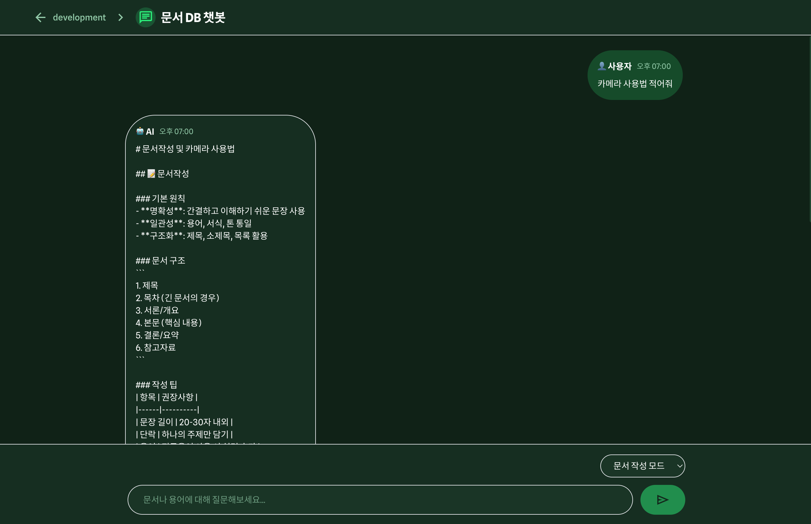
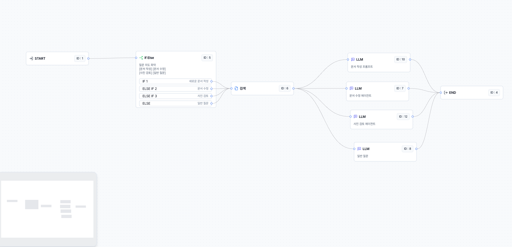

# TermSync - AI 기반 기술 문서 용어 통일 플랫폼



## 📖 서비스 소개

**TermSync**는 AI 기반으로 기술 문서의 용어를 자동으로 분석하고 통일하는 웹 애플리케이션입니다.

여러 문서에 산재된 용어를 AI가 자동으로 분석하여 표준 용어로 일관되게 통일해주며, 문서 작성 및 수정을 위한 챗봇 기능을 제공합니다. **Storm API**를 활용하여 문서 파싱, 워크스페이스 관리, RAG 기반 챗봇 기능을 구현했습니다.

### 핵심 가치

- ⚡ **빠른 분석**: 대량의 문서도 수 초 내에 스캔하여 용어 불일치를 찾아냅니다
- 📄 **다양한 형식**: PDF, DOCX 등 현업에서 사용하는 모든 기술 문서 포맷을 지원합니다
- 🎯 **정확한 통일**: 단순 매칭이 아닌 문맥을 이해하는 AI가 가장 적합한 표준 용어를 제안합니다
- 🤖 **AI 챗봇**: 문서 기반 질의응답 및 문서 작성/수정 모드를 지원합니다

---

## 🖼️ 주요 화면

### 1. 랜딩 페이지


서비스 소개와 주요 기능을 한눈에 볼 수 있는 랜딩 페이지입니다.

### 2. 워크스페이스 선택



프로젝트별로 워크스페이스를 생성하고 관리할 수 있습니다. Storm API를 통해 워크스페이스(Bucket)를 생성하고 조회합니다.

### 3. 모드 선택



작업 목적에 맞는 모드를 선택합니다:

- **용어 통일 모드**: 기존 문서의 용어를 분석하고 통일
- **자동 문서/용어 생성 모드**: AI 기반 문서 작성 및 챗봇

### 4. 용어 통일 모드 - 문서 업로드



PDF, DOCX 파일을 드래그 앤 드롭으로 업로드합니다. Storm Parse API를 사용하여 문서를 파싱하고 텍스트를 추출합니다.

### 5. 문서 DB 챗봇



워크스페이스의 문서를 기반으로 질의응답을 제공하는 챗봇입니다. Storm API의 RAG 기능을 활용하여 문서 검색 및 답변을 생성합니다.

---

## 🚀 주요 기능

### 1. 용어 통일 모드

여러 기술 문서에 산재된 용어를 자동으로 분석하고 통일합니다.

1. **문서 업로드**: PDF/DOCX 파일 업로드 (최대 5개)
2. **AI 분석**: Storm Parse API로 문서 파싱 → OpenAI로 용어 분석
3. **용어 검토**: AI가 제안한 용어 그룹 검토 및 선택
4. **적용**: 선택한 용어로 문서 일괄 변경
5. **결과**: 통일된 문서 다운로드 및 DB 저장

### 2. 문서 작성/수정 모드

AI 챗봇을 통해 문서를 작성하거나 수정합니다.

- **채팅 모드**: 일반적인 질의응답
- **문서 작성 모드**: 새 문서 작성 지원
- **문서 수정 모드**: 기존 문서 수정 지원

Storm API의 RAG 기능을 활용하여 워크스페이스 내 문서를 기반으로 답변을 생성합니다.

### 3. 워크스페이스 관리

프로젝트별로 워크스페이스를 생성하고 관리합니다.

- 워크스페이스 생성 및 조회 (Storm API)
- 문서 관리
- 용어 관리

---

## 🛠 기술 스택

### Frontend

- **Next.js 14** (App Router)
- **React 18**
- **TypeScript**
- **Tailwind CSS**
- **Zustand** (상태 관리)
- **Material Symbols** (아이콘)

### Backend & APIs

- **Storm API** (Sionic)
  - 문서 파싱: `https://storm-apis.sionic.im/parse-router/api/v2`
  - 워크스페이스 관리: `https://live-stargate.sionic.im/api/v2/buckets`
  - 챗봇 (RAG): `https://live-stargate.sionic.im/api/v2/answer`
- **OpenAI API** (GPT-4)
  - 용어 분석 및 그룹화
  - 문서 생성 지원

### Database

- JSON 파일 기반 (로컬 스토리지)

---

## 📦 설치 및 실행

### 1. 의존성 설치

```bash
npm install
```

### 2. 환경 변수 설정

`.env.local` 파일을 생성하고 다음 환경 변수를 설정하세요:

```env
# Storm API
NEXT_PUBLIC_STORM_API_KEY=your_storm_api_key_here
NEXT_PUBLIC_PARSE_STORM_API_KEY=your_parse_storm_api_key_here
NEXT_PUBLIC_AGENT_ID=7408016797648121856

# OpenAI API
OPENAI_API_KEY=your_openai_api_key_here
```

### 3. 개발 서버 실행

```bash
npm run dev
```

브라우저에서 [http://localhost:3000](http://localhost:3000)을 열어주세요.

---

## 📁 프로젝트 구조

```
termsync/
├── app/                      # Next.js App Router
│   ├── api/                  # API Routes
│   │   ├── workspaces/       # 워크스페이스 API
│   │   ├── unify/            # 용어 통일 API
│   │   ├── generate/         # 자동 생성 API
│   │   └── chat/             # 챗봇 API
│   ├── workspace/            # 워크스페이스 페이지
│   │   └── [id]/             # 동적 라우트
│   │       ├── unify/        # 용어 통일 모드
│   │       ├── generate/     # 자동 생성 모드 (챗봇)
│   │       └── chat/         # 챗봇
│   ├── layout.tsx            # 루트 레이아웃
│   ├── page.tsx              # 랜딩 페이지
│   └── globals.css           # 글로벌 스타일
├── api/                      # 클라이언트 사이드 API
│   ├── file-parse.api.ts    # Storm Parse API 클라이언트
│   ├── workspace.api.ts      # 워크스페이스 API 클라이언트
│   └── chat.api.ts           # 챗봇 API 클라이언트
├── lib/                      # 라이브러리
│   ├── db/                   # Database
│   │   └── json-db.ts        # JSON DB 구현
│   └── storm.ts              # Storm API 유틸리티
├── store/                    # Zustand 스토어
│   ├── unifyStore.ts         # 용어 통일
│   ├── generateStore.ts      # 자동 생성
│   ├── chatStore.ts          # 챗봇
│   └── workspaceStore.ts     # 워크스페이스
├── types/                    # TypeScript 타입
│   ├── workspace.ts
│   ├── unify.ts
│   ├── generate.ts
│   ├── chat.ts
│   └── db.ts
├── data/                     # JSON 데이터 파일
│   ├── workspaces.json
│   ├── documents.json
│   └── terms.json
└── image/                    # 스크린샷 이미지
    ├── image-1.png
    ├── image-2.png
    ├── image-3.png
    ├── image-4.png
    └── image-5.png
```

---

## 🔌 Storm API 연동

TermSync는 **Storm API**를 핵심 인프라로 사용합니다.

### 사용 중인 Storm API 엔드포인트

1. **문서 파싱**

   - 엔드포인트: `https://storm-apis.sionic.im/parse-router/api/v2/parse/by-file`
   - 기능: PDF/DOCX 파일을 업로드하고 텍스트로 파싱
   - 클라이언트: `api/file-parse.api.ts`

2. **워크스페이스 관리**

   - 조회: `GET https://live-stargate.sionic.im/api/v2/buckets?agentId&page&size`
   - 생성: `POST https://live-stargate.sionic.im/api/v2/buckets`
   - 클라이언트: `api/workspace.api.ts`

3. **RAG 기반 챗봇**
   - 엔드포인트: `POST https://live-stargate.sionic.im/api/v2/answer`
   - 기능: 워크스페이스 내 문서를 기반으로 질의응답
   - 클라이언트: `api/chat.api.ts`

### Storm API 인증

모든 Storm API 요청에는 `storm-api-key` 헤더가 필요합니다:

```typescript
headers: {
  "storm-api-key": process.env.NEXT_PUBLIC_STORM_API_KEY,
}
```

---

## 🏗️ 시스템 아키텍처

### AI 챗봇 에이전트 플로우

TermSync의 챗봇은 사용자의 질문 의도를 파악하고, 적절한 에이전트로 라우팅하여 답변을 생성합니다.



#### 처리 프로세스

1. **의도 파악 (Intent Identification)**

   - 사용자 질문의 의도를 분석합니다
   - 지원하는 의도:
     - **문서 작성**: 새로운 문서 생성 요청
     - **문서 수정**: 기존 문서 수정 요청
     - **일반 질문**: 일반적인 질의응답

2. **검색 단계 (Search/RAG)**

   - 모든 의도에 대해 먼저 검색을 수행합니다
   - 워크스페이스 내 문서를 검색하여 관련 컨텍스트를 수집합니다
   - Storm API의 RAG 기능을 활용합니다

3. **전문 에이전트 라우팅**

   - 의도에 따라 적절한 LLM 에이전트로 라우팅됩니다:
     - **문서 작성 프롬프트**: 문서 작성 전용 프롬프트로 처리
     - **문서 수정 에이전트**: 문서 수정 전용 에이전트로 처리
     - **일반 질문**: 일반 챗봇 모드로 처리

4. **응답 생성**
   - 각 에이전트가 검색된 컨텍스트를 바탕으로 최종 답변을 생성합니다

이 아키텍처를 통해 사용자의 의도에 맞는 정확하고 맥락에 맞는 답변을 제공할 수 있습니다.

---

## 🎨 디자인 시스템

### 색상

- **Primary**: `#2bee79` (Neon Green)
- **Background Dark**: `#102217`
- **Surface Dark**: `#162e21`
- **Border Green**: `#234832`
- **Text Dim**: `#92c9a8`

### 폰트

- **Display**: Spline Sans
- **Body**: Noto Sans KR
- **Icons**: Material Symbols Outlined

---

## 📝 사용 예시

### 용어 통일 모드

1. 워크스페이스 선택 또는 생성
2. "용어 통일 모드" 선택
3. PDF/DOCX 파일 업로드 (최대 5개)
4. "분석 시작" 클릭
5. Storm Parse API로 문서 파싱
6. OpenAI로 용어 분석 및 그룹화
7. 용어 검토 및 선택
8. 통일된 문서 다운로드

### 문서 작성/수정 모드

1. 워크스페이스에서 "자동 문서/용어 생성 모드" 선택
2. 모드 선택 (채팅/문서 작성/문서 수정)
3. 질문 입력
4. Storm API RAG 기능으로 문서 기반 답변 생성
5. 결과 확인 및 활용

---

## 🔧 개발 가이드

### 빌드

```bash
npm run build
```

### 프로덕션 실행

```bash
npm start
```

### 타입 체크

```bash
npm run type-check
```

---

## 📄 라이센스

이 프로젝트는 개인 프로젝트입니다.

---

## 🤝 기여

이슈나 제안사항이 있으시면 이슈를 등록해주세요.

---

**TermSync** - 기술 문서의 완벽한 일치를 위한 AI 솔루션
